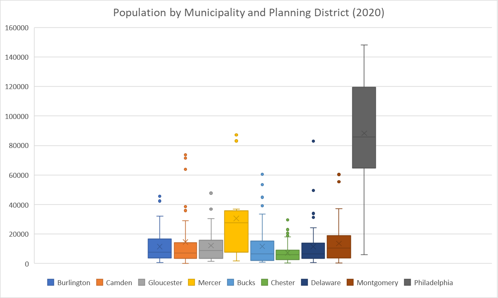
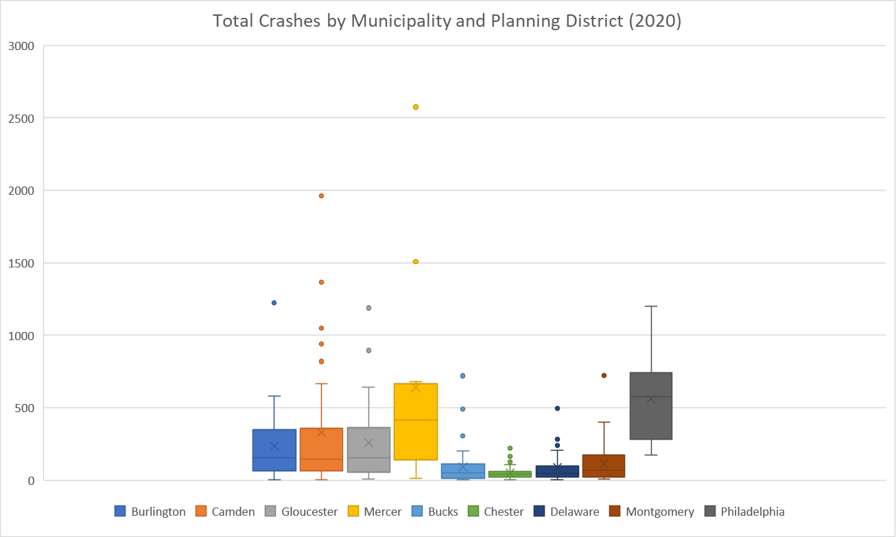
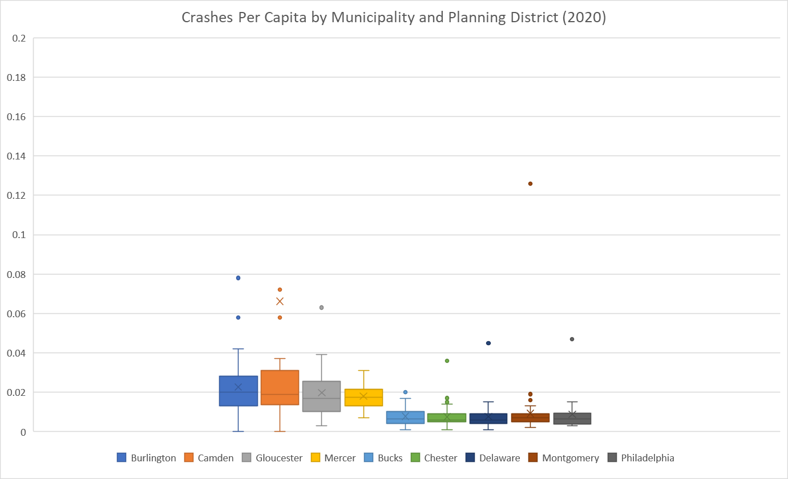

# Planning Data Specialist Assignment
This repo is for the DVRPC Planning Data Specialist Candidate Exercise. The scenario for this exercise is the Office of Safe Streets (OSS) has requested support in developing a reproducible data process to consume crash data and population for a quick high-level understanding of crashes per capita by municipality across the region.

It uses two datasets from DVRPC's [Data Catalog](https://catalog.dvrpc.org/dataset/):  
1. [Crash Summary and Fatal Counts](https://catalog.dvrpc.org/dataset/crash-summary-and-fatal-counts)  
2. [Adopted 2050 v1.0 Population & Employment Forecasts](https://catalog.dvrpc.org/dataset/adopted-2050-v1-0-population-employment-forecasts)

## Python Scripts
### import_data.py
This script imports the data from DVRPC's data catalog. It uses a function to join the crash and population datasets, calculate the crashes per capita, and export a csv file for each year. Although the crash data ranges from 2008 to 2020, there are only two years for the data output (2015 and 2020) because population data was not available for other years. This script also creates a dataframe (CRASH_APPENDED_DF) that is called upon in other Python scripts in this repo.

### change.py
This script imports the CRASH_APPENDED_DF and uses a function to calculate the change in total crashes and crashes per capita between two years and export these results to a csv file. The pct_chg function allows the user to input the two years they want to use for the calculation.

### summary_stats.py
This script imports the CRASH_APPENDED_DF and uses functions to provide summary statistics for total crashes and crashes per capita at the municipality/planning district- and county-levels and exports these results to csv files. The script also uses a function to detect and drop outliers using z score and exports these results to csv files.

## Charts
### Population

The chart above shows the 2020 population for municipalities and planning districts in the Greater Philadelphia region. One key takeaway from this chart is that the populations in the Philadelphia planning districts are much higher than most of the municipalities in the region. These large populations can skew crash per capita results in the planning districts.

### Crashes

The chart above shows the 2020 crash totals by municipality and planning district. Aside from Philadelphia, the NJ counties have a higher volume of crashes than the suburban PA counties. 

### Crashes per Capita

The chart above shows the 2020 crash per capita values by municipality and planning district. Once again, the NJ counties show higher totals than the PA counties.

## Summary and Future Analysis

### Summary
This analysis shows the limitations of comparing crash and population data at the municipal and planning district level. It is helpful to know crash totals and crashes per capita at these geographies, but additional data is necessary to provide an insightful analysis. 

### Future Work
Future analysis of crash and population data should incorporate more sophisticated data filtering processes and evaluate this data at smaller geographies. As noted in a previous [DVRPC report](https://www.dvrpc.org/reports/18022.pdf), there is a discrepancy in crash severity definitions and reporting in PA and NJ. Therefore, selecting crashes that led to a fatality or serious injury (KSI) is one way to help standardize the data between the two states to allow for a better comparison. Additionally, it would helpful to have road classification (Interstate/Arterial/Collector/Local) and Vehicle Miles Traveled (VMT) data to segment geographies based on road composition and travel volume. Regarding geography, this work would also benefit from analyzing crash data at smaller geographies such as Traffic Analysis Zones (TAZ) and census tracts considering the lack of uniformity with municipal and planning district sizes and boundaries.